如果你不出去走走，你会以为这就是世界。

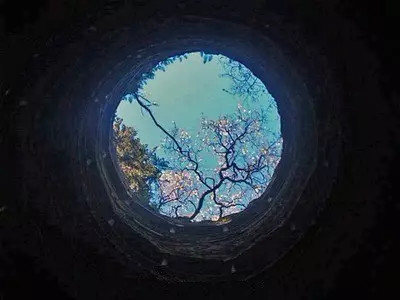

---

你永远无法满足所有人。走自己的路，让他们说去吧！

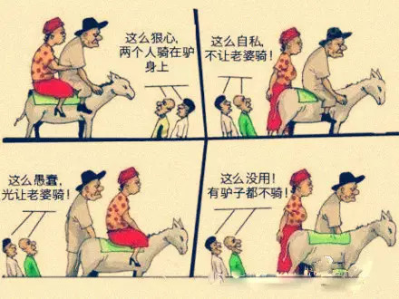

---

真正的婚姻不是生活一辈子不吵架，而是吵架了还能生活一辈子。

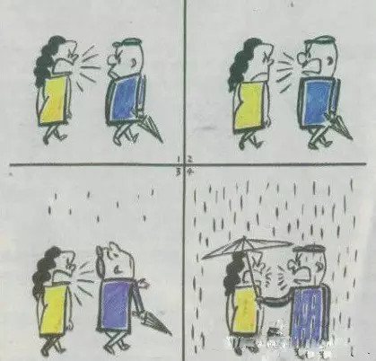

---

表面繁荣未必是好事，抛开表象看实质才是人生真谛。

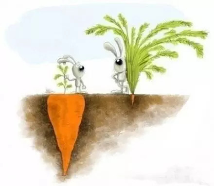

---

别沮丧，生活就像心电图，一帆风顺就证明你挂了。

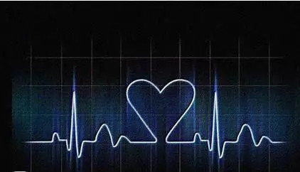

---

当下一个是你时，有些事就没有那么好笑了！

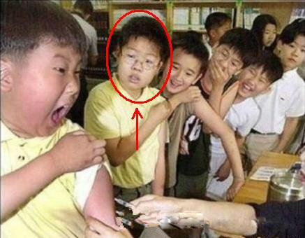

---

可怕的不是真坏人，而是假好人！

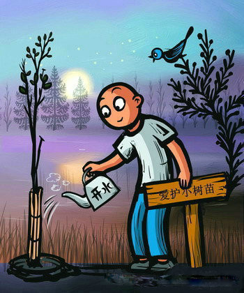

---

乐观是一种态度。

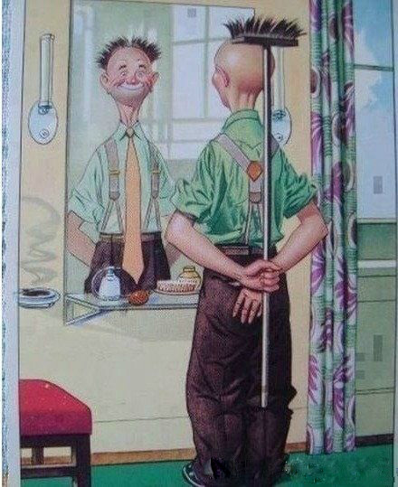

---

你所知道的不要全说，你所看到的不要全信。

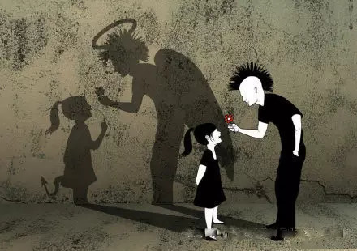

---

塑造自己，过程很疼，但你最终你能收获一个更好的自己。

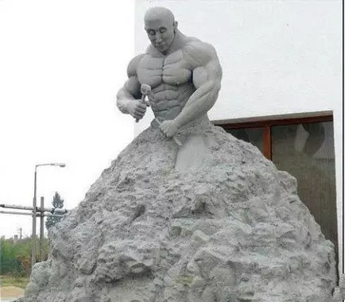

---

痛苦的时候，正是成长的时候。

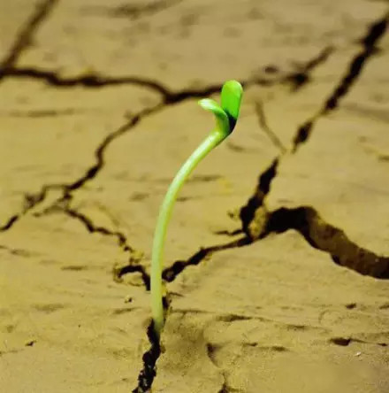

---

我不太肯定我的方向，但是我希望自己能走的远一点。

---

有的时候，信任，就是这么一回事。

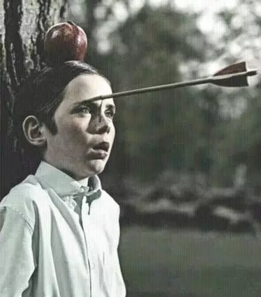

---

一生之爱，触动到你了吗？

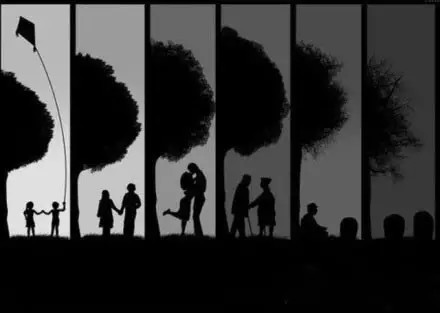

---

经常告诉自己，别放弃！

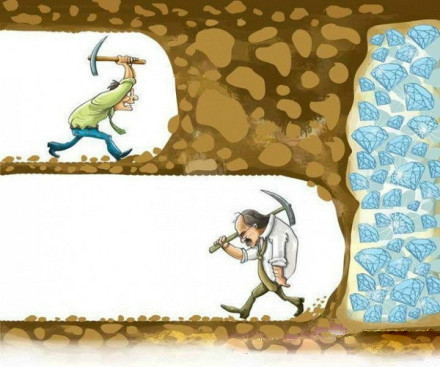
